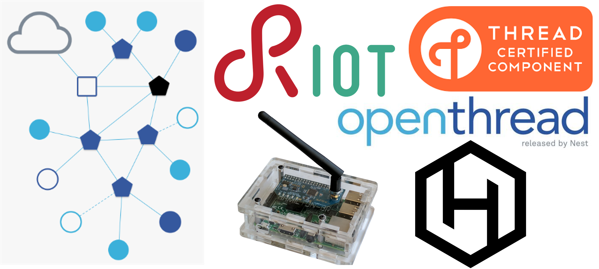

## Hamilton-RIOT-OpenThread firmware: CLI command version

This application provides an OpenThread test environment on a [hamilton border router](https://hamiltoniot.com/collections/frontpage/products/hamilton-hg1-gateway). [OpenThread](https://github.com/openthread/openthread) is an open source implementation of [Thread](https://threadgroup.org/), a mutihop wireless mesh protocol for Internet of Things (IoT). [RIOT](https://github.com/RIOT-OS/RIOT) is an open source IoT operating system.

While running, each node performs OpenThread network operation. But the application layer does nothing but wait for CLI commands. Users can test various Openthread operations (border router, router, sleepy end device) by putting [CLI commands](https://github.com/openthread/wpantund/wiki/OpenThread-Simulator-Tutorial).

Note: The three applications in this branch have their own README.



## Open source version
RIOT code is modified based on its [2017-10-release](https://github.com/RIOT-OS/RIOT/tree/2017.10-branch).

OpenThread code is modified based on its [commit 10f6c4f0cd5cd80a5720e054c960e439fbbf52b8](https://github.com/openthread/openthread/commit/10f6c4f0cd5cd80a5720e054c960e439fbbf52b8) on Feb.02.2018.

Wpantund code is modified based on its [commit 506ae4043b6dfec5d28325c9fa048911fc61305a](https://github.com/openthread/wpantund/commit/506ae4043b6dfec5d28325c9fa048911fc61305a) on Feb.27.2018.

## Environment setup
Before installing any application, you need to do the following things:

1. Download RIOT, OpenThread, and Wpantund source codes, run
```
../Hamilton-RIOT-Openthread-fw$ git submodule update --init --remote --recursive
```

2. Turn on JTAG for programming, run
```
../Hamilton-RIOT-Openthread-fw$ JLinkExe
J-Link> power on
```

## Future work
We are currently working on merging our code onto the RIOT's master branch.

https://github.com/RIOT-OS/RIOT/pull/7149

https://github.com/RIOT-OS/RIOT/pull/7823

https://github.com/RIOT-OS/RIOT/pull/7826

https://github.com/RIOT-OS/RIOT/pull/8971

https://github.com/RIOT-OS/RIOT/pull/8978

https://github.com/RIOT-OS/RIOT/pull/8989

https://github.com/RIOT-OS/RIOT/pull/9013
